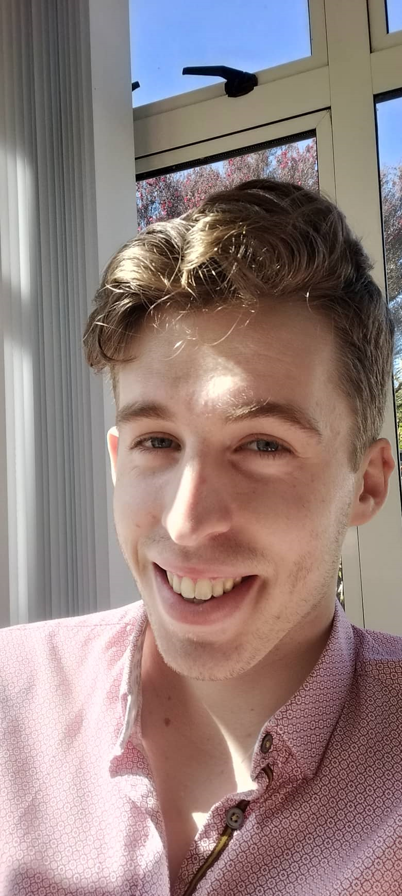

---
# Group 8

**Russell Syder**  
email: russellsyder@gmail.com  
ORCHID ID: 0000-0002-4582-5909  

PHOTO

**Frances Smith**  
email: frances.j.smith.nz@gmail.com  
ORCHID ID: 0000-0002-5168-3134

```{r frances, out.width="30%", out.height="40%", echo = FALSE}
knitr::include_graphics("Frances.png")

```
```{r russell, out.width="20%", out.height="34%", echo = FALSE}


```

# Textual Description of the Dataset


# Visualisations


# Anything we found interesting


# Future Steps

Our future steps include, doing a factor analysis 


